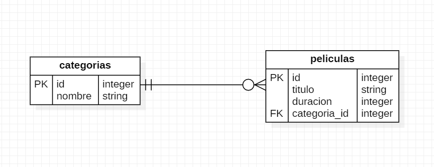

# Asociaciones 1 a N utilizando modelos

Para toda la información necesaria según la documentación lo pueden encontrar en el siguiente link

[Guía de Asociaciones Rails](https://guides.rubyonrails.org/association_basics.html)

## Implementarlo en Rails

Vamos a desarollar una aplicación donde una película solamente puede tener 1 categoría, pero una categoría puede pertenecer en varias películas. La relación **1 a N** se vería reflejada de la siguiente manera:



Para comenzar a implementarlo en rails debemos tomar en cuenta que al igual que la base de datos, es mucho mejor comenzar a definir las tablas "independientes", lo que significa que son las que no tienen llave foránea en sus columnas. Así que comenzaremos con Categorías que la crearemos en inglés para evitar conflictos de nombres por ahora.

```console
rails g model Category name: string
```
Con *scaffold*
```console
rails g scaffold Category name: string
```

Para relacionarlos más rápido utilizando la línea de consola podemos ejecutar el siguiente código, comando en cuenta que la llave foránea debemos definirla como *references* (sí, con **s** al final) para que el modelo entienda que ya existe uno con ese nombre

```console
rails g model Movie title:string duration:integer category:references
```

Con *scaffold*
```console
rails g scaffold Movie title:string duration:integer category:references
```

## Rutas aniadadas

Las rutas anidadas nos ayudan a orgainzar mejor los recursos que dependen de otros, por ejemplo en la página

`https://www.themoviedb.org/movies/{movie_id}/images`

Así que si quisiéramos obtener imágenes de una película, deberíamos tener el ID de la película y agregar /images

Si ponemos otros ejemplos ya en código para aplicaciones de Rails, podríamos llegar a definir rutas haciendo uso de *resources* para definir todas las rutas CRUD pre establecidas

```ruby
Rails.application.routes.draw do
    resources :buildings do
        resources :apartments
    end
end
```

En el caso de desarrollar un Blog y tener un post con diferentes imágenes, videos y comentarios, podría llegar a ser de la siguient manera

```ruby
Rails.application.routes.draw do
    resources :posts do
        resources :images
        resources :videos
        resources :comments
    end
end
```

Si quisiéramos obtener la lista de películas por categorías, tendríamos que hacerlo de la siguiente manera:
```ruby
Rails.application.routes.draw do
    resources :categories do
        resources :movies
    end
end
```

## Terminar el nuevo CRUD

**TODO: Revisar migraciones**
**TODO: Finalizar modelos**
**TODO: Finalizar modelos**
**TODO: ¿Qué pasa con los controladores y vistas?**


## Borar en cascada

Debemos agregar *dependent: :destroy* en la relación **has_many** que tenga un modelo con otro, esto hará que un recurso elimina los que están relacionados con él en forma de cascada y así evitar el error.

### CUIDADO 🤚🚫

Esto permitirá eliminar muchos registros de una sola vez, así que debemos saber cuándo utilizamos este código

```ruby
class Author < ApplicationRecord
  has_many :books, dependent: :destroy
end
```
